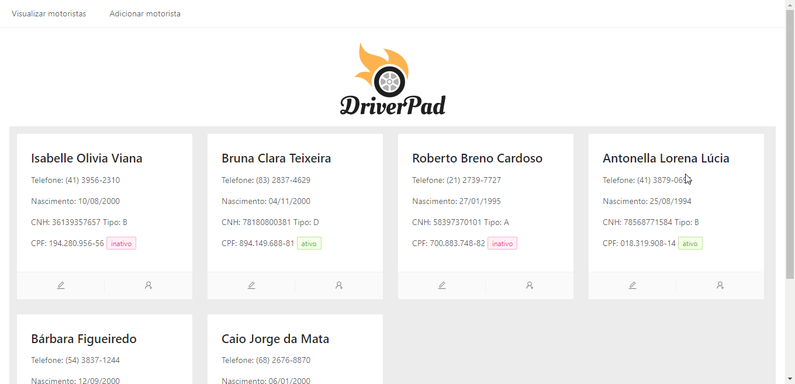

O DriverPad é uma aplicação desenvolvida para registrar motoristas de todo o Brasil.



---

#### 🌐 Deploy da aplicação: https://driverpad.vercel.app/

---

### 💻 Tecnologias e bibliotecas utilizadas

- ReactJS
- Ant Design
- NPM

---

### 🔨 Requisitos para rodar o projeto

- [NodeJS](https://nodejs.org/en/) versão 12+
- NPM

---

### 🚀 Executando o projeto localmente

1. Clone o projeto na sua máquina

```
git clone https://github.com/leticiacamposs2/driverpad.git
```

2. Acesse a pasta do projeto 

```
cd driverpad
```

3. Instale as dependências

```
npm install
```

4. Execute a aplicação

```
npm run dev
```

5. Abra o navegador e visualize o projeto no seguinte endereço:

```
http://localhost:3000
```

----

### 🔥 API Fake

Ao executar a aplicação seguindo os passos acima, a biblioteca Json Server irá simular uma API REST com o conteúdo do arquivo json [db.json](./db.json) deste projeto, que ficará disponível em http://localhost:5000


Método   | Endpoint   | Descrição
--------- | ------ | ------
GET | /drivers | Lista todos os motoristas
GET | /drivers/1 | Lista o motorista especifico
POST | /drivers | Salva um motorista
PUT | /drivers/1 | Edita um motorista

----

### 🔮 Próximos passos

- Consulte aqui em: [issues](https://github.com/leticiacamposs2/driverpad/issues) 
- Planejamento no quadro: [kanban](https://github.com/leticiacamposs2/driverpad/projects/1)

----

### ⚙️ Executando os testes unitários da aplicação

- No terminal na pasta driverpad execute o seguinte comando:

```
npm run test -- --coverage --watchAll=false
```
